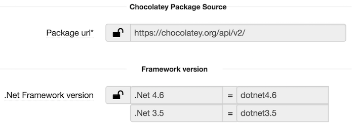

## Dotnet framework component

### Overview

Dotnet framework component gives an ability to install different .net frameworks on windows compute/node. This component uses chocolatey to install .net frameworks. Chocolatey packages can be used from public chocolatey repository or within the firewall hosted repository. If you need more information about chocolatey please refer chocolatey section below.

### Prerequisite

* Chocolatey package repository, this can be public or internal package source.
* Required .net framework chocolatey package.

### Parameters

Parameter              | Description                                            | Comments    
---------              |-------------                                           |-----    
Package url            | Url of the chocolatey repository                       | Add the url of the chocolatey package source, this will be overridden if mirror cloud service has been defined.   In the mirror cloud service the key to used be is "chocolatey-repo".
Net Framework version  |  Add the .net framework version details.               | Format:   .Net framework version = chocolatey package name   Examples:   .Net 3.5 = dotnet3.5   .Net 4.5.2 = dotnet4.5.2   By default, .net version 4.6 is added.  

### How it looks?

### Chocolatey
Chocolatey is a package manager for Windows (like apt-get/yum but for Windows). It was designed to be a decentralized framework for quickly installing applications and tools that you need. The applications and tools can be installers like DB drivers, binaries, msi etc, these installers are packaged into chocolatey packages. The chocolatey packages are hosted on repository servers like nexus, artifactory, nuget server and also in local or shared drive.

The public chocolatey repository url is https://chocolatey.org/api/v2/ .
