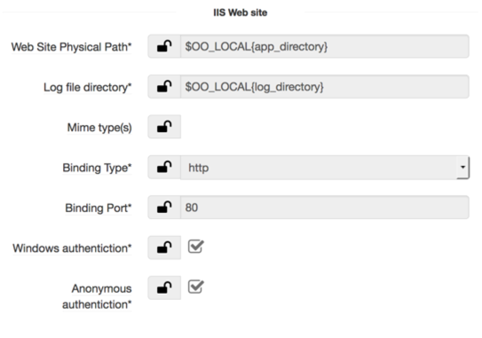
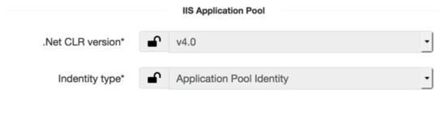
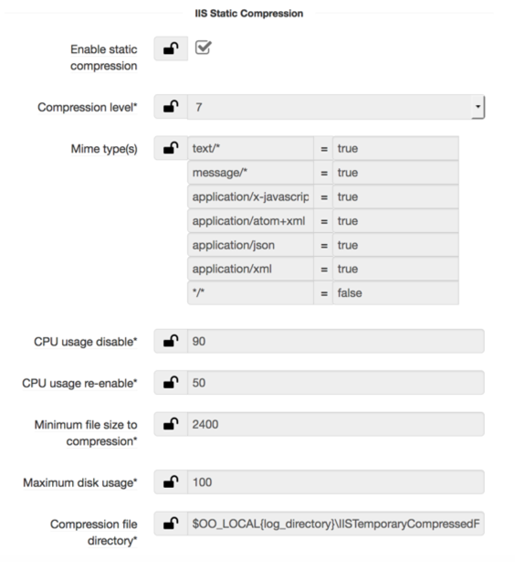
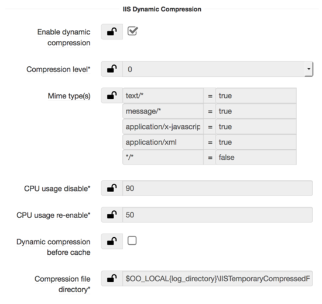
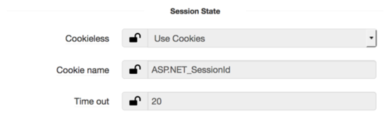
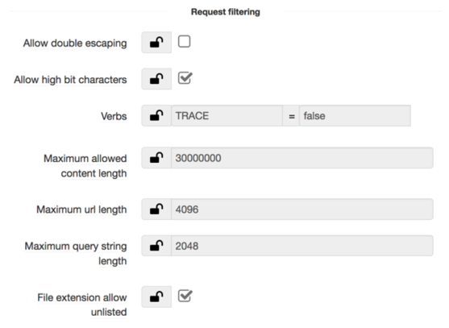

## IIS-website

### Overview

IIS-website component gives the ability to create website, application pool and configure different attributes in IIS.

IIS-website has got followings sections:

* IIS Website section
* IIS Application Pool section
* IIS Static Compression section
* IIS Dynamic Compression section
* Session State section
* Request filtering section

### IIS Website section
In this section you configure basic attributes of your website

Attribute              | Description                                                          | Notes   
---------              |-------------                                                         |-----    
Website physical path  | The physical path on disk this Web Site will point to                | Default value: E:\Apps
Log file directory     | Set central w3c and central binary log file directory                | Default value: E:\Logs
Mime type(s)           | Adds MIME type(s) to the collection of static content types          | Eg: .tab = application/xml
Binding type           | Select HTTP/HTTPS bindings that should be added to the IIS Web Site  | Default value: HTTP
Binding Port           | Set the binding port                                                 |
Windows Authentication | Enable windows Authentication                                        | Default value: true
Anonymous authentication | Enable anonymous authentication                                    | Default value: true

### IIS Application Pool section
In this section you configure application pool attributes

 Attribute              | Description                                                         | Notes   
 ---------              |-------------                                                        |-----    
 .Net CLR version       | The version of .Net CLR runtime that the application pool will use  | Default value: v4.0
 Identity type          | Select the built-in account which application pool will use         | Default value: Application Pool Identity

### IIS Static Compression
In this section you configure static compression parameters

Attribute                        | Description                                                          | Notes   
---------                        |-------------                                                         |-----    
Enable static compression	       | Specifies whether static compression is enabled for URLs.	          | Default value: true
Compression level	               | Compression level - from 0 (none) to 10 (maximum)	                  | Default value: 7
Mime type(s)	                   | Which mime-types will be / will not be compressed                    |
CPU usage disable	               | The percentage of CPU utilization (0-100) above which compression is disabled | Default value: 90%
CPU usage re-enable	             | The percentage of CPU utilization (0-100) below which compression is re-enabled after disable due to excess usage                                                                                            |	Default value: 50%
Maximum disk usage	             | Disk space limit (in megabytes), that compressed files can occupy	  | Default value: 100 MB
Minimum file size to compression | The minimum file size (in bytes) for a file to be compressed	        | Default value: 2400 bytes
Compression file directory       |Location of the directory to store compressed files                   |

### IIS Dynamic Compression section
In this section you configure static compression attributes

Attribute                        | Description                                                          | Notes   
---------                        |-------------                                                         |-----    
Enable static compression	       | Specifies whether static compression is enabled for URLs.	          | Default value: true
Compression level	               | Compression level - from 0 (none) to 10 (maximum)	                  | Default value: 0
Mime type(s)	                   | Which mime-types will be / will not be compressed                    |
CPU usage disable	               | The percentage of CPU utilization (0-100) above which compression is disabled | Default value: 90%
CPU usage re-enable	             | The percentage of CPU utilization (0-100) below which compression is re-enabled after disable due to excess usage                                                                                            |	Default value: 50%
Dynamic compression before cache | Specifies whether the currently available response is dynamically compressed before it is put into the output cache	                                                                                          | Default value: false
Compression file directory       | Location of the directory to store compressed files                  | Default value: e:\logs\IISTemporaryCompressedFiles

### Session State section
In this section configure session state attributes

Attribute         | Description                                                                  | Notes   
---------         |-------------                                                                 |-----    
Cookieless        | Specifies how cookies are used for a Web application                         | Default value: v4.0
Cookie name       | Specifies the name of the cookie that stores the session identifier          | Default value: Application Pool Identity
Time out          | Specifies the number of minutes a session can be idle before it is abandoned | Default value: 20

### Request filtering section
Request filtering section

Attribute                        | Description                                                          | Notes   
---------                        |-------------                                                         |-----    
Allow double escaping	           | If set to false, request filtering will deny the request if characters that have been escaped twice are present in URLs.	                                                                                  | Default value: false
Allow high bit characters	       | If set to true, request filtering will allow non-ASCII characters in URLs	| Default value: true
Verbs	                           | Specifies which HTTP verbs are allowed or denied to limit types of requests sent to the Web server |
Maximum allowed content length	 | Specifies the maximum length of content in a request, in bytes	       | Default value: 30000000 bytes
Maximum url length	             | Specifies the maximum length of the query string, in bytes	           | Default value: 4096 bytes
Maximum query string length	     | Specifies the maximum length of the URL, in bytes	                     | Default value: 2048 bytes
File extension allow unlisted	   | Specifies whether the Web server should process files that have unlisted file name extensions.| Default value: true

IIS-website component is also responsible to enable following windows features:

Attribute                         | Description   
---------                         |-------------
Default Document	                | Allows you to specify a default file to be loaded when users do not specify a file in a request URL.
HTTP Errors	                      | Installs HTTP Error files. Allows you to customize the error messages returned to clients.
Static Content	                  | Serves .htm, .html, and image files from a Web site.
HTTP Redirection	                | Provides support to redirect client requests to a specific destination.
HTTP Logging	                    | Enables logging of Web site activity for this server.
Request Monitor	                  | Monitors server, site, and application health.
Tracing	                          | Enables tracing for ASP.NET applications and failed requests.
Static Content Compression	      | Compresses static content before returning it to a client.
Dynamic Content Compression	      | Compresses dynamic content before returning it to a client.
Request Filtering	                | Configures rules to block selected client requests.
Basic Authentication	            | Requires a valid Windows user name and password for connection.
Windows Authentication	          | Windows Authentication
.NET Extensibility	              | Enables your Web server to host .NET framework-managed module extensions.
.NET Extensibility 4.5	          | Enables managed code developers to change, add, and extend Web server functionality in the entire request pipeline, the configuration, and the UI.
ASP.NET 3.5	                      | Provides a server-side object-oriented programming environment for building Web sites and Web applications using managed code.
ASP.NET 4.5	                      | Provides a server-side object-oriented programming environment for building Web sites and Web applications using managed code.
ISAPI Extensions	                | Allows ISAPI extensions to handle client requests.
ISAPI Filters	                    | Allows ISAPI filters to modify Web server behavior.
IIS Management Console            | Installs Web server Management Console which supports management of local and remote Web servers.
IIS Management scripts and Tools	| Manages a local Web server with IIS configuration scripts.
Management Service	              | Allows this Web server to be managed remotely from another computer via the Web server Management Console.
Application Initialization	      | Enables you to perform expensive Web application initialization tasks before serving Web pages.
